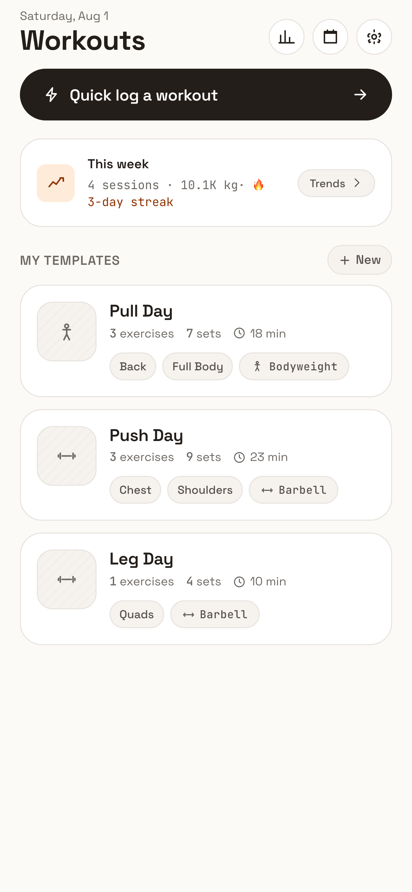
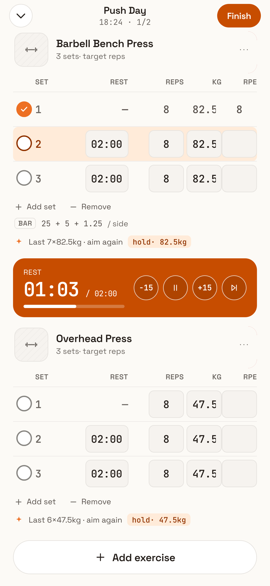
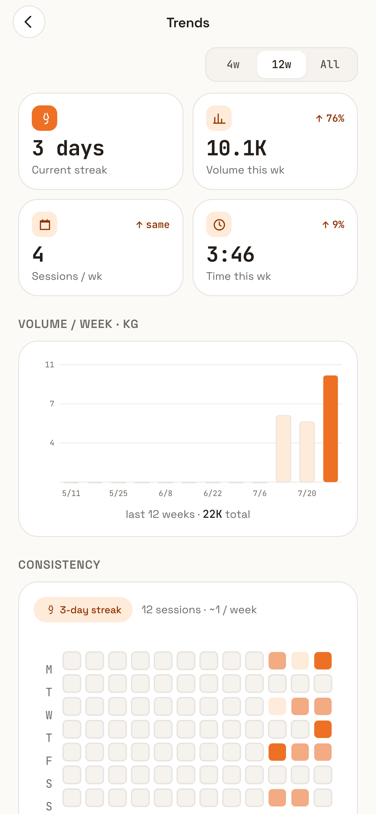
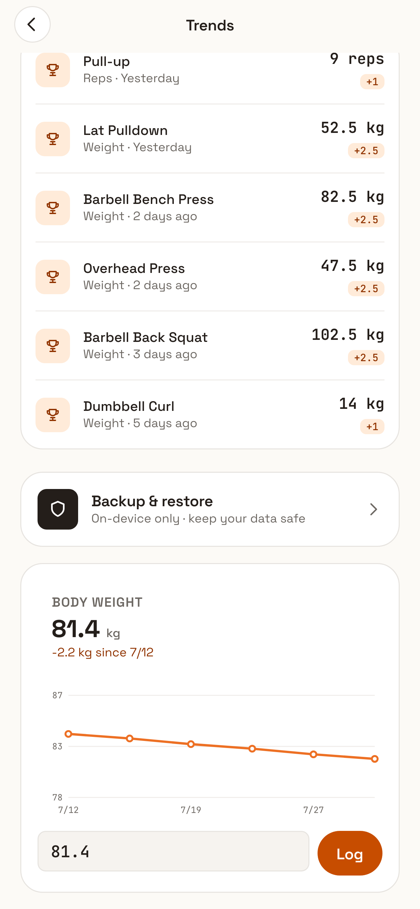

# BuffUp (Buffy)

A local-first workout tracker, live on the App Store — SvelteKit PWA in a Capacitor iOS shell, with Whoop recovery integration and privacy-aware CloudKit sync.

[](https://github.com/Mark6611/buffy/actions/workflows/ci.yml)
[](https://apps.apple.com/app/id6785999682)

<p>
  
  
  
  
</p>

Tracks workouts, sets, and progression; integrates Whoop recovery data; syncs across devices via CloudKit (iCloud) on native builds.

- **Local-first:** all workout data lives on-device in IndexedDB (Dexie); no account required.
- **Whoop integration:** OAuth through Vercel serverless functions (`api/whoop/`), recovery + strain shown alongside training.
- **Analytics:** trends, muscle heatmaps, progression tracking, readiness/intensity scoring.
- **Native:** Capacitor iOS shell with widget sync and health-data privacy handling.

## Architecture

One codebase, two targets: a static SvelteKit build served as a PWA, and the same build embedded in a Capacitor iOS shell (the App Store app).

- **Local-first data flow:** UI components → `src/lib/db/repository.ts` (the only database entry point) → Dexie/IndexedDB. Workout data never requires an account or a backend.
- **CloudKit sync (native builds):** `cloudSync.ts` does a last-write-wins merge across the user's devices via iCloud.
- **Health-data privacy:** `healthPrivacy.ts` strips HealthKit-/Whoop-derived fields from every record pushed to CloudKit and never applies them from pulled records — health metrics are reconstructed locally on each device and never ride sync (App Review Guideline 5.1.3(ii)).
- **Whoop OAuth:** the token exchange runs in Vercel serverless functions (`api/whoop/`); no client secret ships in the app.
- **iOS widget:** `widgetSync.ts` bridges workout data to the home-screen widget.

## Engineering practice

- **168 Vitest unit tests** across 15 files (data layer, sync merge, health-privacy stripping, progression, readiness, intensity, plate math) and **9 Playwright E2E flows** (`e2e/workout.spec.ts`) covering full workout lifecycles: template → log → rest → finish → history, swipe actions, resume-after-reload.
- **CI** (`.github/workflows/ci.yml`): type-check, unit tests, web build, and Playwright E2E on every push and PR.
- **Five committed accessibility gates** in `scripts/`, run against the production build:
  - `verify-contrast.mjs` — WCAG AA ratios (4.5:1 text / 3:1 UI), resolving the oklch design tokens through a real browser engine rather than hand arithmetic.
  - `verify-hit-targets.mjs` — 44pt tap targets measured by actual hit-testing (`elementFromPoint`), so pseudo-element hit areas count.
  - `verify-a11y-semantics.mjs` — VoiceOver-facing semantics asserted in the rendered DOM, not the source.
  - `verify-dynamic-type.mjs` — simulates Dynamic Type scaling and hunts for overflow, clipped text, and collapsed controls.
  - `verify-a11y-phase1.mjs` — geometry checks from the original accessibility audit.
- **Dynamic Type:** text scales live with the user's iOS setting via `font: -apple-system-body` (`src/app.css`).
- **Gated ship pipeline** (`scripts/ship.sh`): unit tests → svelte-check → E2E against a fresh production build → App Store Connect preflight (catches upload blockers *before* an archive is spent) → signed archive → entitlements verified inside the signed binary → upload → tester-group assignment. Gates are never piped (a pipe reports the wrong exit code), and the version bump auto-restores on any failure.

## Where the main code lives

**`src/` is the app.** `api/` hosts the Whoop OAuth serverless functions (deployed with the web app on Vercel). Everything else at the root is packaging and tooling.

```text
src/
├── routes/              Pages (SvelteKit file-based routing)
│   ├── +page.svelte       Home / today
│   ├── workout/           Active workout session
│   ├── quick/             Quick-log entry
│   ├── history/           Past workouts (list + detail)
│   ├── trends/            Analytics: progression, muscle map, backup
│   ├── template/          Workout templates
│   ├── exercise/          Exercise editor
│   ├── picker/            Exercise picker
│   ├── whoop/             Whoop OAuth callback
│   └── settings/          Settings
└── lib/
    ├── db/              ⭐ Data layer — START HERE
    │   ├── repository.ts   The ONLY database entry point; components
    │   │                   never touch Dexie directly.
    │   ├── dexie.ts        IndexedDB schema
    │   └── seed.ts         Built-in exercise seed data
    ├── stores/          Svelte 5 rune stores: workout session, editor,
    │                    settings, recovery, whoop
    ├── components/      Reusable UI + `components/charts/` (sparklines,
    │                    heatmap, body map, line/bar charts)
    ├── analytics.ts     Trends + aggregate stats
    ├── progression.ts   Progressive-overload logic
    ├── readiness.ts     Recovery/readiness scoring
    ├── intensity.ts     Set/session intensity scoring
    ├── plates.ts        Barbell plate math
    ├── calories.ts      Calorie estimation
    ├── whoopMatch.ts    Matching Whoop activities to logged workouts
    ├── cloudSync.ts     iCloud/CloudKit sync (last-write-wins merge)
    ├── widgetSync.ts    iOS widget data bridge
    └── healthPrivacy.ts Health-data privacy handling
api/
└── whoop/               Vercel serverless functions for Whoop OAuth
                         (token exchange happens server-side; no secrets
                         in the client)
```

Supporting directories:

| Path | What it is |
|---|---|
| `ios/` | Capacitor-generated Xcode project |
| `e2e/` | Playwright end-to-end tests |
| `scripts/` | `ship.sh` pipeline + the five `verify-*.mjs` accessibility gates |
| `*.md` | [APP-STORE-SUBMISSION.md](APP-STORE-SUBMISSION.md), [UAT-NATIVE.md](UAT-NATIVE.md), UAT report |

## Develop

```sh
npm install
npm run dev
```

| Command | Purpose |
|---|---|
| `npm run dev` | Dev server |
| `npm test` | Unit tests (Vitest) |
| `npm run test:e2e` | Playwright e2e tests |
| `npm run check` | Type-check (svelte-check) |
| `npm run ios:sync` | Capacitor build + sync to the Xcode project |
| `npm run ios:open` | Open the Xcode project |
| `scripts/ship.sh` | Full TestFlight ship pipeline |

## Conventions

See [CLAUDE.md](CLAUDE.md) for project conventions (data model, ship rules, gotchas).

## Related projects

Part of a small family of local-first apps built the same way:

- [coffee-brew-log](https://github.com/Mark6611/coffee-brew-log) — espresso & pour-over brew log (SvelteKit + Capacitor), live on the [App Store](https://apps.apple.com/app/id6786772685)
- [chawan](https://github.com/Mark6611/chawan) — matcha brew log (local-only; App Store review in progress)
- [html-brew](https://github.com/Mark6611/html-brew) — Brew Sheet, the Astro blog companion to the brew-log apps
